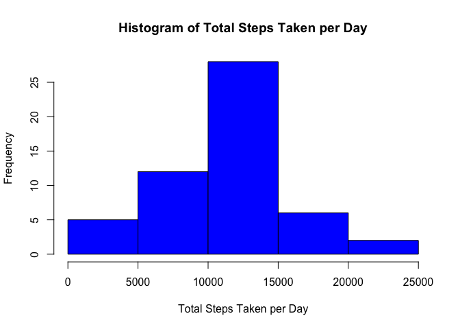
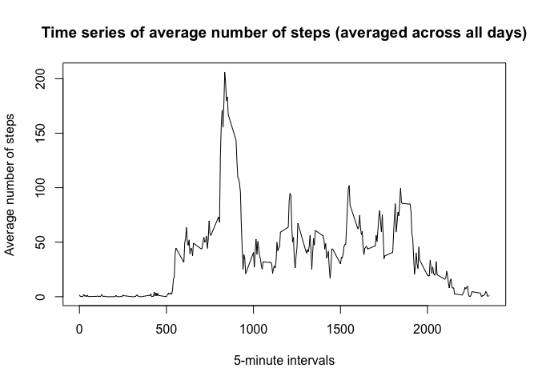
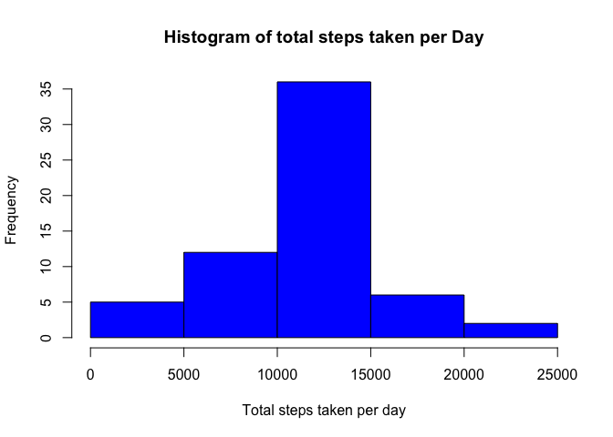
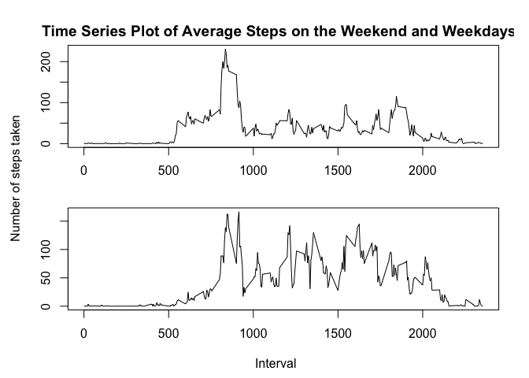

# Reproducible Research: Peer Assessment 1

## Loading and preprocessing the data

```r
activity <- read.csv("activity.csv")
summary(activity)
```

```
##      steps                date          interval     
##  Min.   :  0.00   2012-10-01:  288   Min.   :   0.0  
##  1st Qu.:  0.00   2012-10-02:  288   1st Qu.: 588.8  
##  Median :  0.00   2012-10-03:  288   Median :1177.5  
##  Mean   : 37.38   2012-10-04:  288   Mean   :1177.5  
##  3rd Qu.: 12.00   2012-10-05:  288   3rd Qu.:1766.2  
##  Max.   :806.00   2012-10-06:  288   Max.   :2355.0  
##  NA's   :2304     (Other)   :15840
```

## Mean total number of steps taken

```r
steps_per_day <- tapply(activity$steps, activity$date, sum)
hist(steps_per_day, col = "blue", main = "Histogram of Total Steps Taken per Day",
     xlab = "Total Steps Taken per Day")
```

 


```r
options(digits = 6)
org_mean <- mean(steps_per_day, na.rm = TRUE)
org_median <- median(steps_per_day, na.rm = TRUE)
```
The estimated mean is 1.076619\times 10^{4}, while the estimated median is 10765.

## Average daily activity pattern
Time series plot of the average number of steps taken (averaged across all days).

```r
int <- unique(activity$interval)
avg_steps_across_days <- tapply(activity$steps, activity$interval, mean, na.rm = TRUE)
plot(int, avg_steps_across_days, type = "l", main = "Time series of average number of steps (averaged across all days)", xlab = "5-minute intervals", ylab = "Average number of steps")
```

 

Determine the 5-minute interval that contains the maximum number of steps.

```r
max_steps <- max(avg_steps_across_days)
index_max <- which(avg_steps_across_days == max_steps)
max_steps_int <- activity$interval[index_max]
```
The 5-minute interval that contains the maximum number of steps is *835* (across all the days in the dataset).

## Imputing missing values
The total number of missing values in the dataset (i.e. the total number of rows with NAs).

```r
sum(is.na(activity$steps))
```

```
## [1] 2304
```

A new dataset with the NAs replaced by the average number of steps for that given interval.

```r
activity_NA_rem <- activity
index_NAs <- which(is.na(activity_NA_rem$steps))
int <- unique(activity$interval)

for (i in index_NAs){
    interval_of_i <- activity_NA_rem$interval[i]
    activity_NA_rem$steps[i] <- avg_steps_across_days[which(int == interval_of_i)]
}
sum(is.na(activity_NA_rem$steps))
```

```
## [1] 0
```

A histogram of the total number of steps taken each day.

```r
steps_per_day_NA_rem <- tapply(activity_NA_rem$steps, activity_NA_rem$date, sum)
hist(steps_per_day_NA_rem, col = "blue", main = "Histogram of total steps taken per Day",
     xlab = "Total steps taken per day")
```

 
 
Mean and median of dataset where NAs have been replaced.

```r
options(digits = 6)
imput_mean <- mean(steps_per_day_NA_rem)
imput_median <- median(steps_per_day_NA_rem)
```
The mean with imputted values is, 1.076619\times 10^{4}. The median with the imputted values is 1.076619\times 10^{4}.


```r
diff_mean <- abs(org_mean - imput_mean)
diff_median <- abs(org_median - imput_median)
```

When NA values were removed the mean and median with imputted values are, 0 and 1.188679, respectively. As we can see, there is no difference between the mean, and a slight difference with the median.

## Comparison in activity patterns between weekdays and weekends

Using the dataset with the filled-in missing values for this part a new factor variable in the dataset with two levels is created -- "weekday" and "weekend" indicating whether a given date is a weekday or weekend day.

```r
activity_NA_rem$day <- weekdays(as.Date(activity_NA_rem$date))
#set all values to "weekday"
activity_NA_rem["dayType"] <- "weekday"
#change Saturday & Sundy values to "weekend"
activity_NA_rem$dayType[activity_NA_rem$day %in% c("Saturday", "Sunday")] <- "weekend"
```

A panel plot containing a time series plot (i.e. type = "l") of the 5-minute interval (x-axis) and the average number of steps taken, averaged across all weekday days or weekend days (y-axis).

```r
avg_steps_df <- tapply(activity_NA_rem$steps, list(activity_NA_rem$interval, activity_NA_rem$dayType), mean)
avg_steps_df <- data.frame(avg_steps_df)
```

```r
par(mar = c(2,2,2,1), mfrow = c(2,1), oma=c(2.5,2.5,1,1))
plot(int, avg_steps_df$weekday, type = "l", xlab = "weekday", ylab = "", main = "Time Series Plot of Average Steps on the Weekend and Weekdays  ")
plot(int, avg_steps_df$weekend, type = "l", xlab = "weekend", ylab = "")
mtext(outer=T, side=1, line=1, text="Interval")  #caption for x-axis
mtext(outer=T, side=2, line=1, text="Number of steps taken")  #caption for y-axis
```

 

